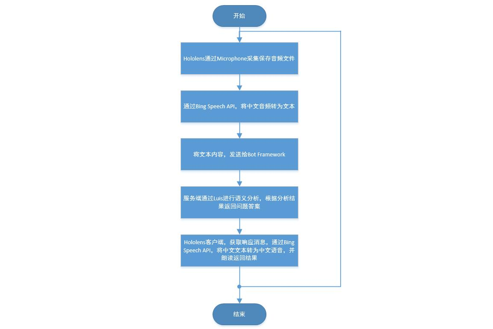
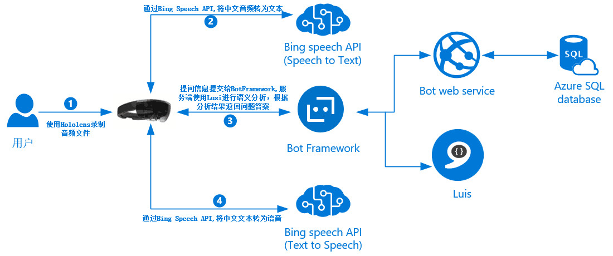
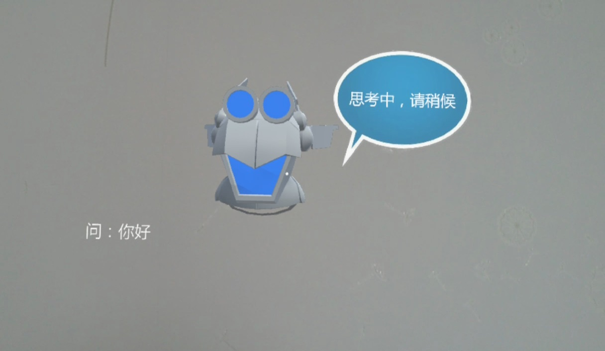
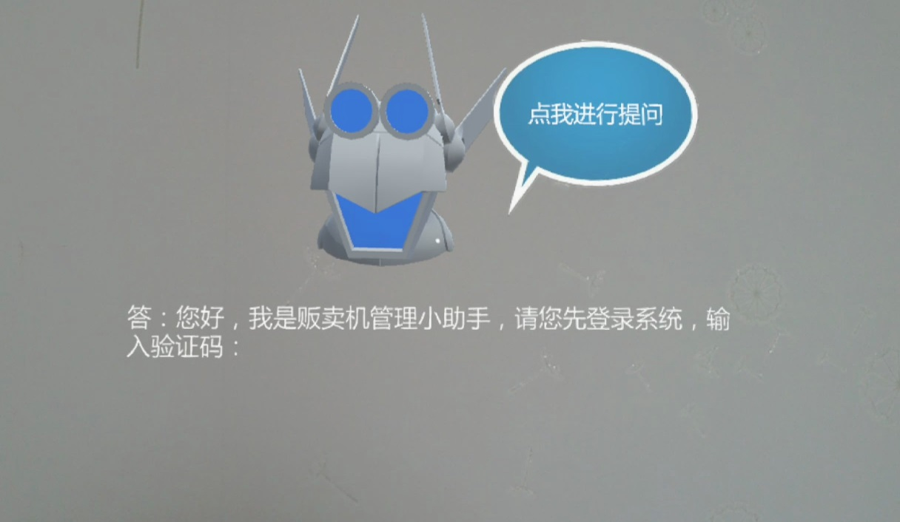
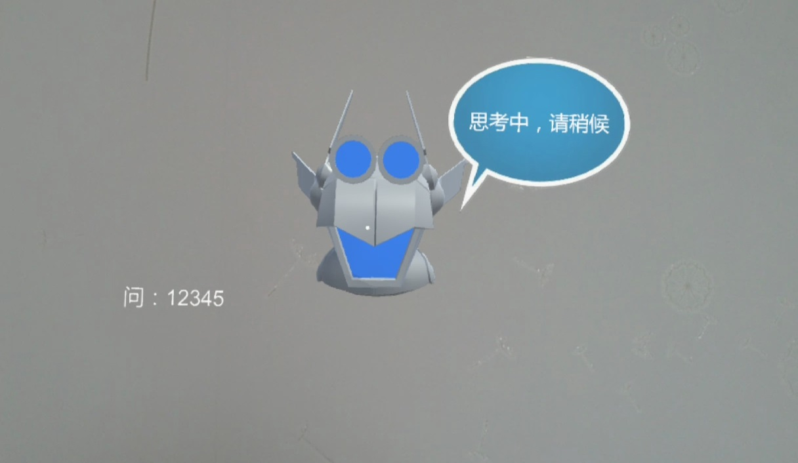
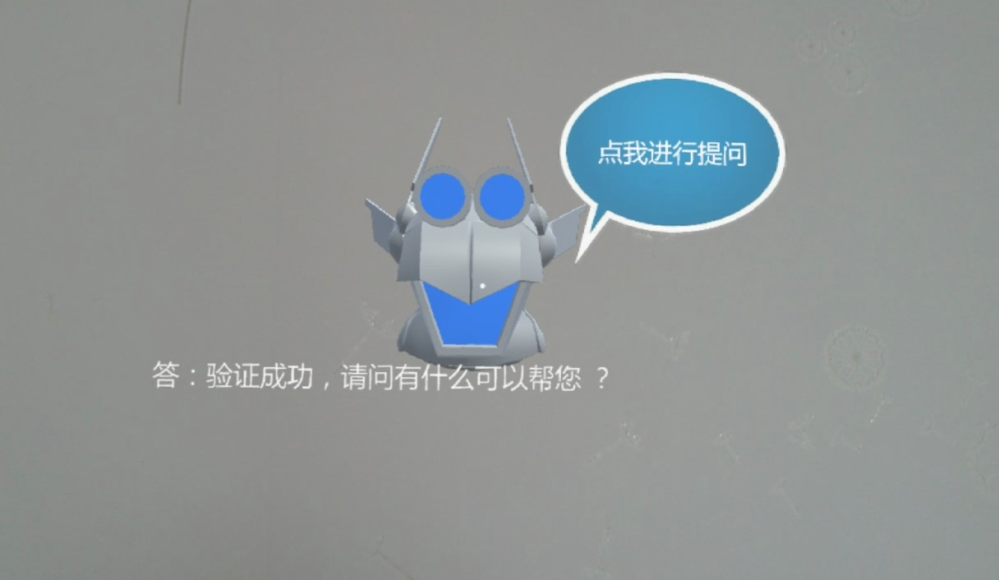
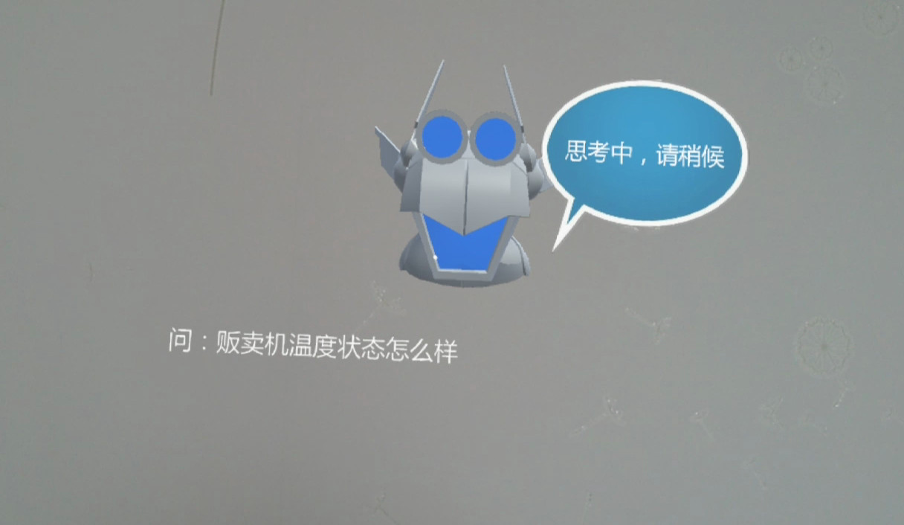
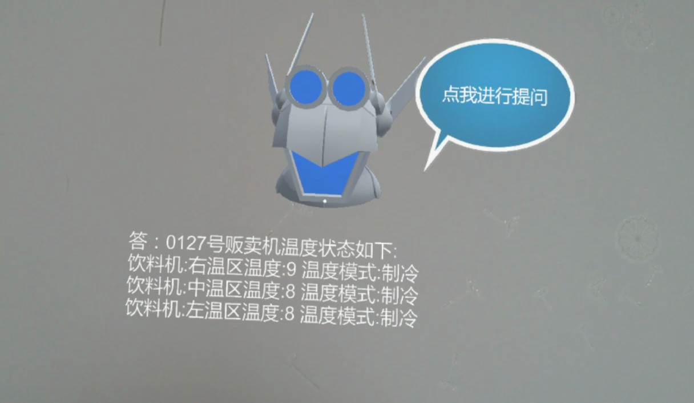
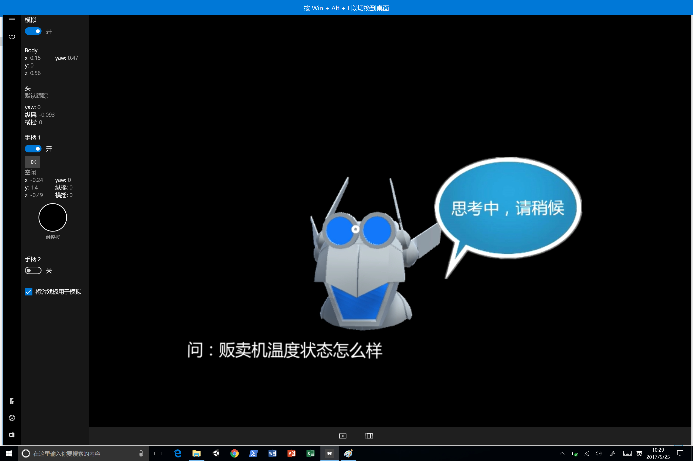
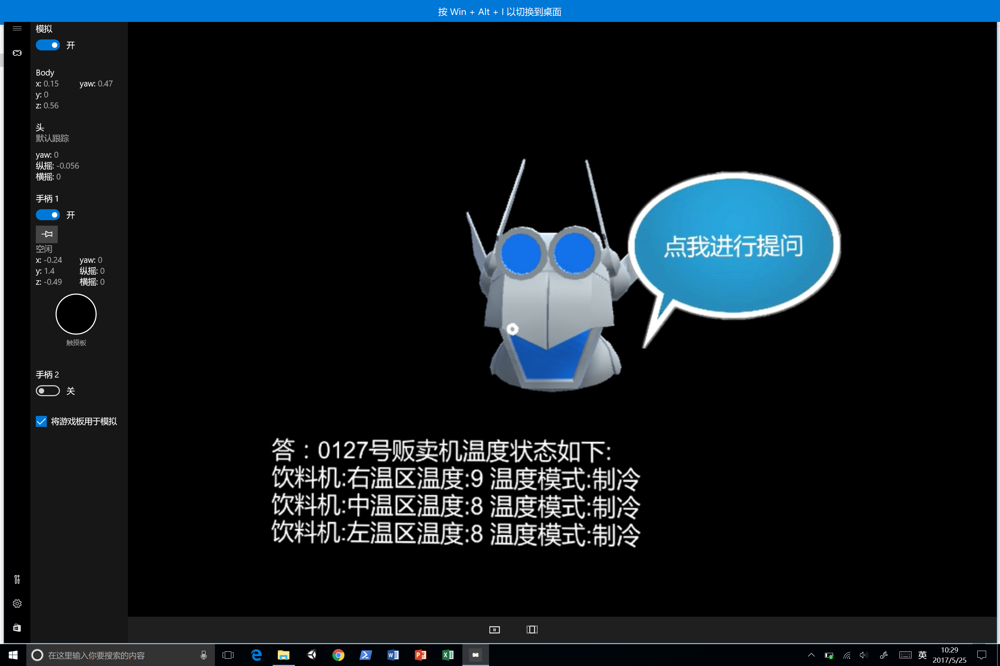

# HoloBot #

本文件夹为HoloLens端Unity工程文件。实现通过Microphone采集保存中文语音，调用Bing Speech API将中文语音转为中文文本，然后发送消息给Bot Framework（Bot后端调用LUIS进行语义识别并生成相应回答内容），最后通过Bing Speech API，将Bot Framework返回的消息转为中文语音并朗读的功能

整体架构图如下：  

### HoloToolkit-Unity说明 ###

本项目使用HoloToolkit-Unity实现凝视和点击功能，[HoloToolkit-Unity](https://github.com/Microsoft/HoloToolkit-Unity/tree/master/External/Unitypackages "HoloToolkit-Unity")版本为v.1.5.6.0

### 软件说明 ###
*Unity*　　　　　  版本 Unity 5.5.0f3  
*Visual Studio*　　版本 Visual Studio 2015 Update 3

### 脚本说明 ###
*SpeechToText.cs*　　中文语音转文字。使用Microphone将语音录制成文件后，通过Bing Speech API将中文语音文件转成中文文本，发送消息给Bot Framework获取提问答案  
*TextToSpeech.cs*　　中文文字转语音。通过Bing Speech API，将Bot Framework响应消息，转成中文语音，然后播放  
*ModelManager.cs*　　模型控制脚本。控制录音的开始与结束，控制提示信息的显示，控制响应消息的显示  
*BotService.cs*　　　 Bot Framework服务脚本。提供创建会话，发送消息，获取消息方法  
[*SavWav.cs*](https://gist.github.com/darktable/2317063 "SaveWav.cs")　　　　 Unity中AudioClip保存成WAV文件开源代码  
[*JSONObject.cs*](https://github.com/mtschoen/JSONObject/blob/master/JSONObject.cs "JSONObject.cs")　   Unity中使用JSON的开源代码

### 运行步骤 ###
1. 启动HoloBot App
2. 等待系统初始化完成，提示“点我进行提问”后进行操作
3. 使用AirTap手势，点击机器人，当出现麦克风图标时进行提问（录音时间为3秒钟，代码中可进行修改）。根据LUIS中定义的问答范围进行提问
4. 等待返回结果

### 运行结果 ###
**Hololens运行结果**
  

本项目支持在Windows Holographic中运行  
**Windows Holographic运行结果**

### VendingMachineBotDemo支持的问答范围 ###
**对话逻辑如下**

Q: 你好

A: 您好，我是贩卖机管理小助手，请您先登录系统，输入验证码：

Q: 123456

A: 验证成功，请问有什么可以帮您？

Q: 贩卖机当前状态怎么样？

A: 0127号贩卖机工作正常

Q: 是否需要补充货物？

A: 0127号贩卖机货物充足

Q: 13号货物通道是什么？

A: 0127号贩卖机13货道商品名称：银鹭好粥道黑米粥（280g罐）有货

Q: 贩卖机温度状态怎么样?

A: 0127号贩卖机温度状态如下:

饮料机:右温区温度:9 温度模式:制冷

饮料机:中温区温度:8 温度模式:制冷

饮料机:左温区温度:8 温度模式:制冷

Q: 贩卖机位置在哪里？

A: 0127号号贩卖机的具体位置请参考地图链接

Q: 给我看整体状态PowerBi图

A: 0127号贩卖机整体状态PowerBi链接请参考

Q: 谢谢

A: 不客气，请问还有什么可以帮您?
